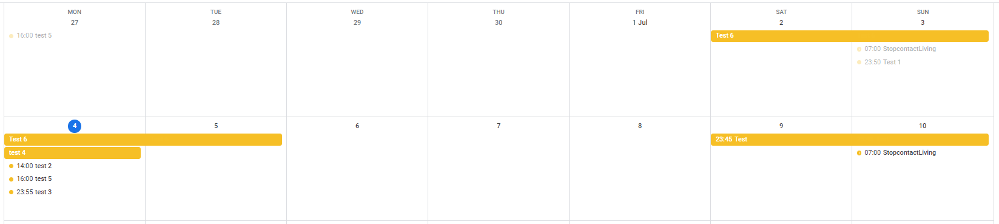

# Google Calendar Interface for IOT apps
This project holds the code of a google web-app that can be used to query your google calendar for i.e. use in IOT applications. The web-app checks your calendar for events that start or end on a specific date and parses the info into a JSON string.

  ## Input
  The date to check can be specified by supplying a correctly formatted date parameter in the URL to this web-app. For an example, the URL to request info on events for 4 july 2022, use this URL: 
  > https://urltowebappgoeshere?date=20220704
  
  The format of the date is: 
  > yyyymmdd

  Note that month and day needs to be specified with two digits. So use 01 instead of 1 for january. If no date is specified, or the formatting is not as expected, the query date will be set to today.

  ## Output
  A JSON record is made for every start and/or end of an event in the calendar on the specified date. Each record contains:
   - If it is the start of an event or the end (type: start/end)
   - The title of the event (title: "Teatime")
   - The description of the event (description: "Afternoon tea chop chop")
   - The time of the start or end of the event: h: hours m: minutes s: seconds (decimals allowed for seconds)
  
  ## Example
   Event "Make tea", with a description of "Afternoon tea chop chop" that starts at 15:00:00.000h end ends at 16:59:59.999h on the query date will be returned as: 
   <pre><code>{"type" = "start", "title": "Make tea", "description": "Afternoon tea chop chop", "h":15, "m":00, "s": 0}, {"type" = "end", "title": "Make tea", "description": "Afternoon tea chop chop",  "h":16, "m":59, "s": 59.999}</code></pre>
   
  ## Test scenarios
   Some basic testscenarios were used, based on this calendar:
   
   The output for 4 July is:
   <pre><code>
   {"type":"end","title":"Test 1","description":"","h":0,"m":30,"s":0}, {"type":"start","title":"test 4","description":"","h":0,"m":0,"s":0}, {"type":"start","title":"test 2","description":"","h":14,"m":0,"s":0}, {"type":"end","title":"test 2","description":"","h":15,"m":0,"s":0}, {"type":"start","title":"test 5","description":"Description goes here","h":16,"m":0,"s":0}, {"type":"end","title":"test 5","description":"Description goes here","h":17,"m":0,"s":0}, {"type":"start","title":"test 3","description":"","h":23,"m":55,"s":0}
   </code></pre>
   
 ## Acknowledgements
  This project was inspired by https://www.instructables.com/Irrigation-Using-Google-Calendar/
  
